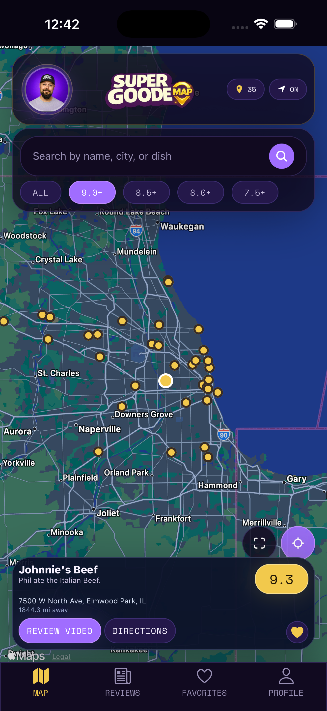
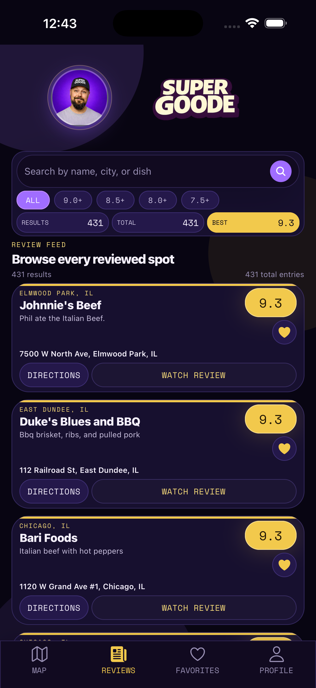
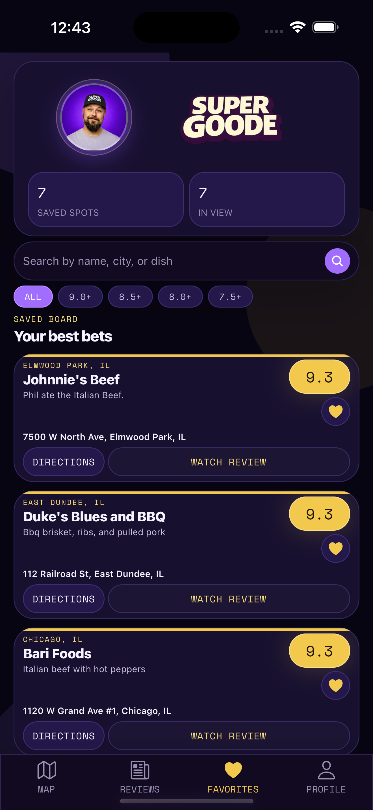
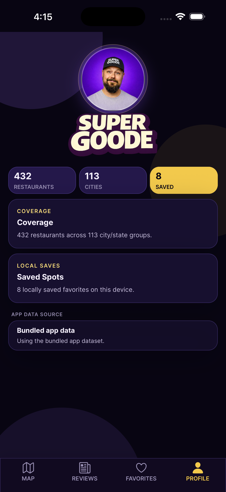

# Super Goode App

Native mobile companion to [Super Goode Map](https://github.com/Retro-Ace/Super-Goode-Map). Super Goode App is an Expo + React Native + TypeScript app built around the shared Super Goode restaurant dataset. It focuses on a polished mobile browsing flow with Map, Reviews, Favorites, and Profile tabs plus an in-app review viewer.


## Current Status

- Beta-ready mobile companion app for iPhone and Android
- Current release cut: iOS build 6, submitted via `npx eas-cli submit` and attached in App Store Connect
- Four public tabs: Map, Reviews, Favorites, and Profile
- No restaurant detail page or detail route
- Bundled app seed currently mirrors 432 restaurants from the canonical web dataset
- 431 of the current 432 rows have map coordinates; the current NYC HALAL EATS record is list-only until the source data is geocoded
- Live feed validation currently accepts 432 / 432 rows from the current web dataset
- Live remote feed support through `EXPO_PUBLIC_LOCATIONS_FEED_URL`
- Runtime data priority: live remote feed, then cached remote snapshot, then bundled local seed fallback
- Shared in-app branding now renders through `BrandArt` using the rounded headshot and current logo assets
- Shared score pills now mirror the web-map score tiers: 9.0+ gold, 8.0 to 8.9 purple, and 7.0 to 7.9 gray
- Startup screen now uses the polished brand-forward boot flow with the old startup card/bobble removed
- Restaurant cards keep the tighter score top-right, heart lower-right, and shared action-button treatment across Map, Reviews, and Favorites
- Review URLs are normalized in-app before playback
- Favorites persist locally on the device

## Highlights

- Map tab with pins, popups, location, and filters
- Reviews tab with branded header, search, score filters, and in-app review viewer
- Favorites tab backed by persistent local storage
- Profile tab with honest feed-mode and cache-state visibility
- Polished startup screen and splash handling that now feels brand-first instead of icon-first
- Directions links and external review fallback actions
- Tightened shared card layout with current score-tier colors and aligned action-button styling
- Shared restaurant data model aligned with the Super Goode web source of truth

## Screenshots

Current simulator captures from the latest app UI.

### Map Experience

<p>
  
  
</p>

### Review Feed



### Saved Spots



### Profile



## Branding and App Icons

Current in-app branding assets:

- `assets/images/branding/super-goode-map-logo.png`
- `assets/images/branding/super-goode-wordmark.png`
- `assets/images/branding/super-goode-headshot.jpg`

The shared `BrandArt` component renders the rounded headshot + logo lockup across Map, Reviews, Favorites, and Profile. Older flattened branding composites are no longer part of the active app asset set.


Current icon pipeline:

- source master: `assets/images/app-icon/source-app-store-icon.png`
- Expo/iOS entrypoint: `assets/images/icon.png`
- splash asset: `assets/images/splash-icon.png`
- web favicon: `assets/images/favicon.png`
- Android adaptive icon assets:
  - `assets/images/android-icon-foreground.png`
  - `assets/images/android-icon-background.png`
  - `assets/images/android-icon-monochrome.png`


## App Store Submission (Finalized Flow)

### Expo Build + Submission

- EAS production build created for `1.0.0 (6)`
- Submitted via `npx eas-cli submit`
- Build processed and attached in App Store Connect

### App Store Connect Required Fixes

- Missing 13-inch iPad screenshot
- Missing copyright field
- Missing Content Rights Information
- Incomplete App Privacy questionnaire

### Final Resolutions

1. iPad Screenshot
   - Captured via the iPad simulator (12.9 / 13-inch)
   - Uploaded to App Store Connect
2. Copyright
   - Set to `2026 SuperGoode`
3. Content Rights
   - Selected `App does not contain third-party content without rights`
   - Justification: the app links externally and does not host content
4. App Privacy
   - Completed the questionnaire
   - Selected `No data collected`
   - Justification: no login, no analytics, no tracking, local-only favorites

### Privacy Policy Hosting

- Public URL: `https://retro-ace.github.io/Super-Goode-App/privacy-policy/`
- Replaced the older GitHub markdown link with a public page that App Store Connect can review directly

### Encryption Declaration

- Uses standard iOS encryption over HTTPS
- No custom encryption is implemented in the app
- Marked as exempt from export compliance documentation

### Final Status

- All App Store Connect errors resolved
- Build successfully uploaded and attached
- App is ready for review

### Public Links and Sources

- Privacy Policy (public): `https://retro-ace.github.io/Super-Goode-App/privacy-policy/`
- Support (public): `https://retro-ace.github.io/Super-Goode-App/support/`
- Privacy policy source: `docs/privacy-policy.md`
- Support source: `docs/support.md`
- Privacy policy HTML: `privacy-policy/index.html`

## Setup

```bash
npm install
npm run sync:seed
npm run check:data
npm run typecheck
npm run ios
```

Other launch options:

```bash
npm run android
npm run web
npm run start
```

## Data Source and Feed Behavior

The web repo remains the canonical source of truth for restaurant data.

- Web source of truth: `../Super Goode/data/locations.json`
- App seed snapshot: `src/data/seed/locations.json`
- Seed sync script: `scripts/sync-locations-seed.mjs`
- Validator: `scripts/validate-location-data.mjs`
- Review URL normalization check: `scripts/check-review-url-normalization.mjs`
- Repository layer: `src/services/restaurantRepository.ts`
- Runtime remote snapshot storage: `src/services/restaurantSnapshotStorage.ts`
- Data sources:
  - `src/data/sources/localLocationsSource.ts`
  - `src/data/sources/remoteLocationsSource.ts`

Current behavior:

- `npm run sync:seed` is a developer workflow that syncs the web dataset into the app seed snapshot and strips web-only fields such as `requestType`.
- The bundled app seed currently contains 432 restaurants and stays normalized to the canonical web dataset shape used by the app.
- 431 current rows are mappable; the current NYC HALAL EATS source row has null coordinates and remains available in list tabs while the Map tab skips it.
- The current live feed validates 432 / 432 rows against the app's accepted record shape.
- The runtime cache is separate from the repo seed: a successful remote load is saved on device as a cached remote snapshot.
- If `EXPO_PUBLIC_LOCATIONS_FEED_URL` is set, the repository reads the live remote JSON feed first.
- If the live feed is unavailable or invalid and a cached remote snapshot exists, the app uses that snapshot next.
- If neither live remote data nor a cached remote snapshot is available, the app falls back to the bundled local seed.
- Directions priority is `googlePlaceUrl`, then `directionsUrl`, then a generated fallback.
- Review URLs are normalized in-app before the review viewer or external fallback uses them.
- The app continues to use the existing Super Goode fields: `name`, `score`, `subtitle`, `address`, `city`, `state`, `lat`, `lng`, `googlePlaceUrl`, `directionsUrl`, `reviewUrl`, `sourceType`, `confidence`, `notes`.

## Sync and Validation

```bash
npm run sync:seed
npm run check:data
npm run check:review-urls
```

To compare the app seed against the web source file in your local checkout:

```bash
npm run check:data -- src/data/seed/locations.json "/Users/anthonylarosa/CODEX/Super Goode/data/locations.json"
```

## Repo Structure

```text
app/            Expo Router routes
assets/         app icons, splash assets, and branding images
docs/           QA notes and breakdown files
screenshots/    README screenshots captured from the simulator
scripts/        seed sync, validation, and review-url helpers
src/components/ reusable UI
src/constants/  app theme values
src/data/       config, local seed, and data-source adapters
src/hooks/      shared hooks
src/providers/  app-level state providers
src/screens/    routed screens
src/services/   repository, snapshot cache, and persistence services
src/types/      shared TypeScript models
src/utils/      helpers
```

## Project Notes

- The app is built for iPhone and Android.
- The Map, Reviews, Favorites, and Profile tabs are the current public app surface.
- The review viewer is in-app, with an external fallback if a review cannot be shown inside the app.
- The app does not have a separate permanent restaurant database.
