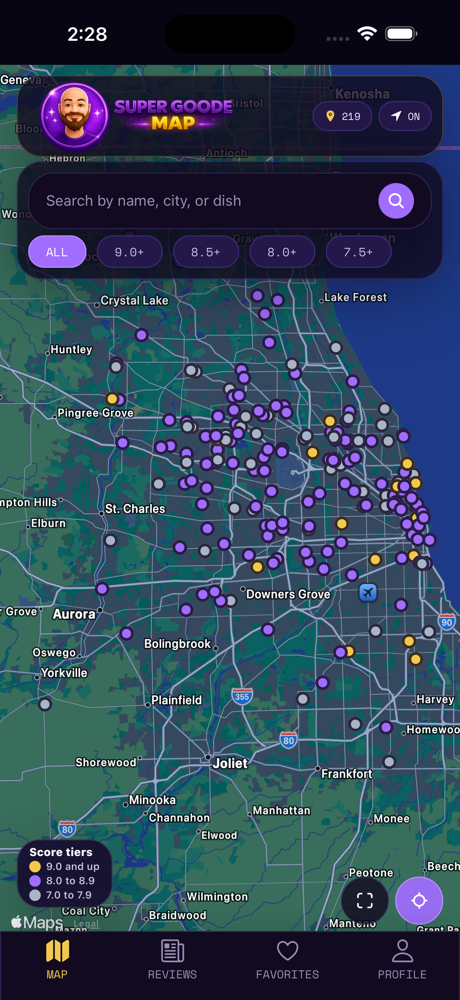
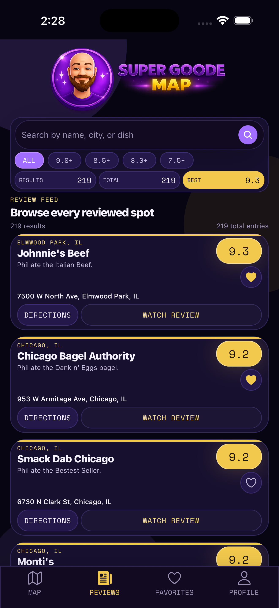
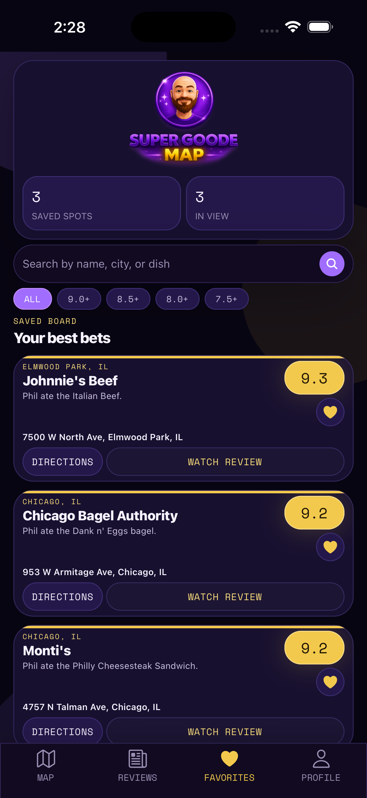
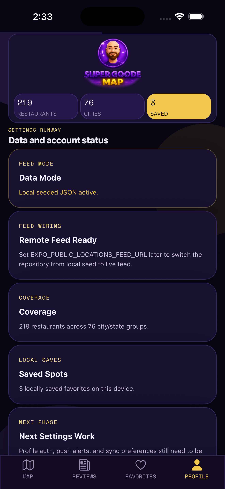
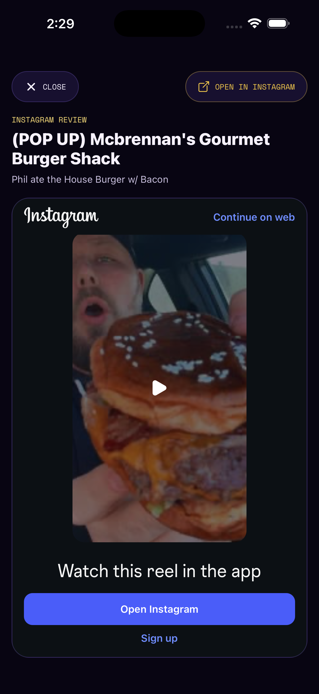
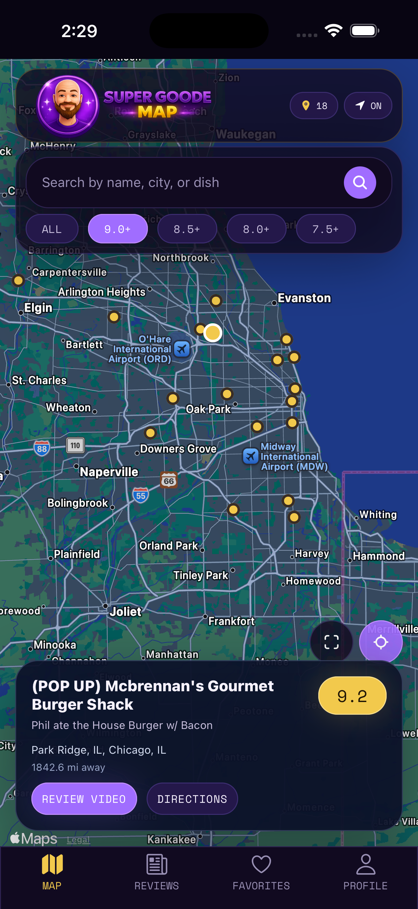
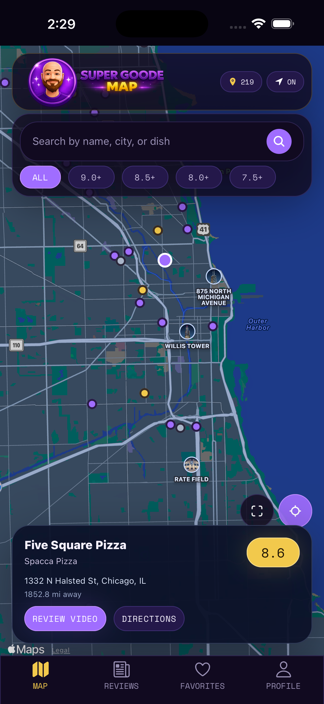

# Super Goode App

Native mobile companion to [Super Goode Map](https://github.com/Retro-Ace/Super-Goode-Map). Super Goode App is an Expo + React Native + TypeScript app built around the shared Super Goode restaurant dataset, with Map, Reviews, Favorites, and Profile tabs and an in-app review viewer.


## Current Status

- Beta-ready mobile app
- Native iPhone and Android app experience
- No restaurant detail page or detail route
- Local seeded dataset with remote feed support through `EXPO_PUBLIC_LOCATIONS_FEED_URL`
- Remote feed fallback to the local seed when the feed fails or is invalid
- Review URLs are normalized in the stored seed data
- Favorites persist locally

## Highlights

- Map tab with pins, popups, location, and filters
- Reviews tab with branded header, search, score filters, and in-app review viewer
- Favorites tab backed by persistent local storage
- Profile tab with data-mode visibility
- Directions links and external review fallback actions
- Shared restaurant data model aligned with the Super Goode web source of truth

## Screenshots

Current app screenshots captured from the simulator.

<table>
  <tr>
    <td></td>
    <td></td>
    <td></td>
  </tr>
  <tr>
    <td></td>
    <td></td>
    <td></td>
  </tr>
</table>



The branding art remains in the repo for presentation and app identity:


## Setup

```bash
npm install
npm run sync:seed
npm run check:data
npm run typecheck
npm run ios
```

Other launch options:

```bash
npm run android
npm run web
npm run start
```

## Data Source

The web repo remains the source of truth for restaurant data.

- Web source of truth: `../Super Goode/data/locations.json`
- App seed snapshot: `src/data/seed/locations.json`
- Seed sync script: `scripts/sync-locations-seed.mjs`
- Validator: `scripts/validate-location-data.mjs`
- Repository layer: `src/services/restaurantRepository.ts`
- Data sources:
  - `src/data/sources/localLocationsSource.ts`
  - `src/data/sources/remoteLocationsSource.ts`

Current behavior:
- The app loads a local parity snapshot of the web dataset by default.
- If `EXPO_PUBLIC_LOCATIONS_FEED_URL` is set, the repository can read a remote JSON feed without changing screen-level code.
- If the remote feed fails validation, times out, or returns invalid data, the app falls back to the local seeded JSON.
- The app continues to use the existing Super Goode fields: `name`, `score`, `subtitle`, `address`, `city`, `state`, `lat`, `lng`, `directionsUrl`, `reviewUrl`, `sourceType`, `confidence`, `notes`.
- Review URLs in the stored seed are normalized so review links stay consistent across the app.

## Sync and Validation

```bash
npm run sync:seed
npm run check:data
```

To verify the app seed still matches the web dataset exactly:

```bash
npm run check:data -- src/data/seed/locations.json "/Users/anthonylarosa/CODEX/Super Goode/data/locations.json"
```

## Repo Structure

```text
app/            Expo Router routes
assets/         app icons, splash assets, branding images
docs/qa/        QA notes and checklist artifacts
scripts/        seed sync and data validation helpers
src/components/ reusable UI
src/constants/  app theme values
src/data/       config, local seed, data-source adapters
src/hooks/      shared hooks
src/providers/  app-level state providers
src/screens/    routed screens
src/services/   repository and persistence services
src/types/      shared TypeScript models
src/utils/      helpers
```

## Project Notes

- The app is built for iPhone and Android.
- The Map, Reviews, Favorites, and Profile tabs are the current public app surface.
- The review viewer is in-app, with an external fallback if a review cannot be shown inside the app.
